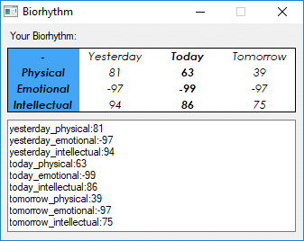

	<b>Biorhythm</b>
	 
	<i>A tool that calculates your biorhythms (physical, emotional and intellectual).</i>
	   
	

# What is 'Biorhythm'?
A biorhythm is an attempt to predict various aspects of a person's life through simple mathematical cycles. The theory was developed by Wilhelm Fliess in the late 19th century, and was popularized in the United States in late 1970s. Most scientists believe that the idea has no more predictive power than chance. "The theory of biorhythms is a theory that claims our daily lives are significantly affected by rhythmic cycles." [Wikipedia](https://en.wikipedia.org/wiki/Biorhythm)

# Usage
Enter your birth date in **YYYY.MM.DD** format.
> release/settings.ini

And then run:
> release/Biorhythm.exe

# Compile
If you want to compile it by yourself:
1. Compile using Aut2Exe:
> src/display.au3
2. Convert with embedded **modules** folder using any Bat2Exe converter with these options: 
- Visibility: **invisible application**
- Working directory: **current**
- Temporary files: **delete on exit**
> src/main.bat
